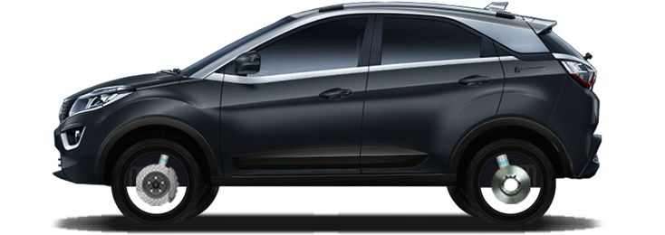
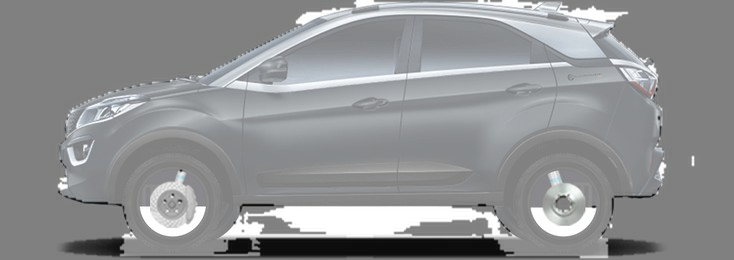
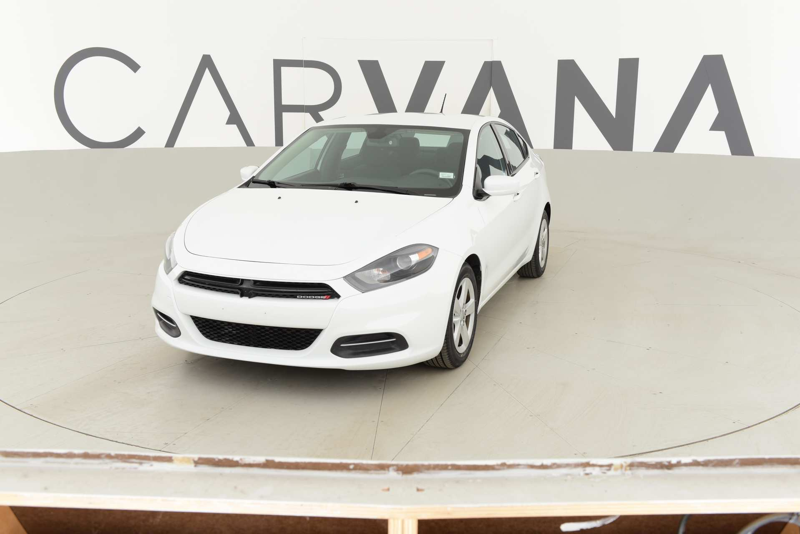
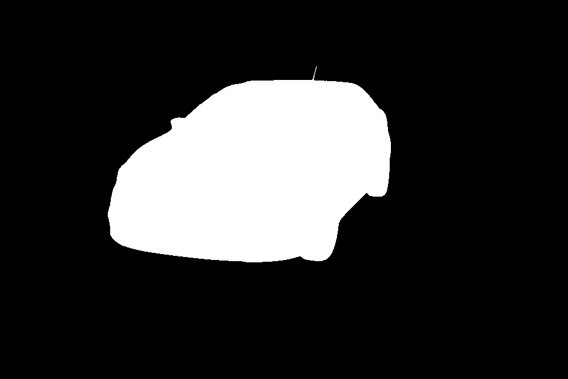
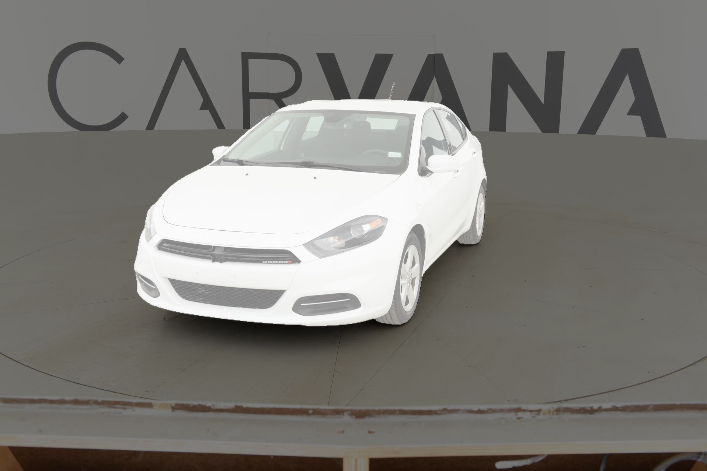

# Image(Car) Segmenation using UNet PyTorch - Carvana Image Masking Challenge


## Getting Started

```
git clone git@github.com:jayakvenu47/pytorch_segmentation.git
cd pytorch_segmentation
```

- [x] Dice loss and Cross Entropy loss used for training. See the [dice loss](unet/utils/loss.py) implementation. `dice_score = 1 - dice_loss` used for evaluation.
- [x] Model weight provided in `weights` folder. Weights saved in f16 (~60MB).
- [x] Use overlay script to generate the overlay image(overlay.py).


## Results
<p float="left">
  <figure style="display: inline-block; margin-right: 10px;">
    
    <figcaption>Original Image</figcaption>
  </figure>
  <figure style="display: inline-block; margin-right: 10px;">
    
    <figcaption>Mask Image</figcaption>
  </figure>
  <figure style="display: inline-block;">
    
    <figcaption>Overlay Image</figcaption>
  </figure>
</p>


<p float="left">
  <figure style="display: inline-block; margin-right: 10px;">
    
    <figcaption>Original Image</figcaption>
  </figure>
  <figure style="display: inline-block; margin-right: 10px;">
    
    <figcaption>Mask Image</figcaption>
  </figure>
  <figure style="display: inline-block;">
    
    <figcaption>Overlay Image</figcaption>
  </figure>
</p>


### Dataset

[Carvana Image Masking dataset](https://www.kaggle.com/c/carvana-image-masking-challenge/data) dataset is used to train the model. After downloading, place them under `./data` directory.

```
├── data
    ├── train_images
         ├── 1.jpg
         ├── 2.jpg
         ├── 3.jpg
          ....
    ├── train_masks
         ├── 1.png
         ├── 2.png
         ├── 3.png
```

### Training

Training arguments

```
usage: train.py [-h] [--data DATA] [--scale SCALE] [--num-classes NUM_CLASSES] [--weights WEIGHTS] [--epochs EPOCHS] [--batch-size BATCH_SIZE] [--num-workers N] [--lr LR] [--weight-decay WEIGHT_DECAY] [--momentum MOMENTUM] [--amp] [--print-freq PRINT_FREQ]
                [--resume RESUME] [--use-deterministic-algorithms] [--save-dir SAVE_DIR]

UNet training arguments

options:
-h, --help
Display the help message and exit.

-data DATA
Path to the dataset directory (default: ./data).

-scale SCALE
Factor to scale the input images (default: 0.5).

-num-classes NUM_CLASSES
The number of output classes (default: 2).

-weights WEIGHTS
Path to the file containing pretrained model weights (default: '').

-epochs EPOCHS
Number of epochs for training (default: 10).

-batch-size BATCH_SIZE
Size of each training batch (default: 4).

-num-workers N
Number of workers for data loading (default: 8).

-lr LR
Learning rate (default: 1e-5).

-weight-decay WEIGHT_DECAY
Weight decay (default: 1e-8).

-momentum MOMENTUM
Momentum value (default: 0.9).

-amp
Enable automatic mixed precision training.

-print-freq PRINT_FREQ
How often to print training progress (default: 10).

-resume RESUME
File path to resume training from a checkpoint (default: '').

-use-deterministic-algorithms
Enforce the use of deterministic algorithms.

-save-dir SAVE_DIR
Directory where model weights will be saved (default: weights).
```

Train the model

```commandline
python train.py
```

### Inference

Inference arguments

```
usage: inference.py [-h] [--model-path MODEL_PATH] [--image-path IMAGE_PATH] [--scale SCALE] [--save-overlay]

Image Segmentation Inference

options:
-h, --help
Display the help message and exit.

-model-path MODEL_PATH
Specify the file path to the model weights.

-image-path IMAGE_PATH
Provide the file path to the input image.

-scale SCALE
Set the scale factor for resizing the image.

-save-overlay
Use this flag to save the overlay image.
```

Inference

```
python inference.py --model-path weights/last.pt --image-path assets/image.jpg
```
